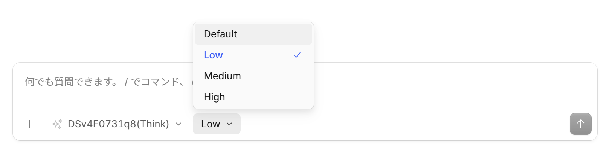

# OpenCode動かし方 (ローカル実行)

## 用意するもの

 - OS: Windows 11 Pro
 - CPU: IntelまたはAMDのCPU
 - GPU: NVIDIA Geforce RTX 5090
 - メモリ: 192 GB以上

## Windowsの設定

設定→システム→詳細設定画面で
 - 長いパスを有効にします
 - 開発者モードを有効にします

エクスプローラーを開いて、隠しファイル、隠しフォルダーを表示します
 - フォルダー オプション→表示タブ→詳細設定のファイルとフォルダーの表示→隠しファイル、隠しフォルダー、および隠しドライブを表示するをチェック

## NVIDIAドライバのインストール

NVIDIAグラフィックスドライバーをインストール。
https://www.nvidia.com/en-us/drivers/

## llama.cppのセットアップ

llama.cppのReleasesページに行って、Windows CUDA13版と、そのすぐ右のリンクのCUDA 13.3 DLLsを持ってきてC:\app\llamacppに展開、CUDA 13.3 DLLファイルを同じフォルダーに配置。 https://github.com/ggml-org/llama.cpp

C:\app\llamacppにPATHを通します(重要)。  設定→システム→バージョン情報→システムの詳細設定→環境変数→ユーザー環境変数のPathを選択状態にして編集→新規→参照→C:\app\llamacpp
あとはOKを押す。

環境変数が正しくセットされたことを確認。CMDを開いて、llamaと打って、llamaの使用方法が表示されたらOK。

MiniForgeをダウンロードしてインストールします。 https://github.com/conda-forge/miniforge/releases/

MiniForge Promptを開いて、condaのhf_download環境を作成します

```
mkdir -p C:\work
cd /d C:\work
conda create -y -n hf_download python=3.12
conda activate hf_download
conda install -y pip
pip install -U pip
pip install -U huggingface_hub hf_transfer
```

unsloth/DeepSeek-V4-Flash-0731-UD-Q8_K_XL.ggufをダウンロードします

```
mkdir -p C:\hf
cd /d C:\hf

for %x in (00001 00002 00003 00004 00005) do hf download hf://unsloth/DeepSeek-V4-Flash-0731-GGUF/UD-Q8_K_XL/DeepSeek-V4-Flash-0731-UD-Q8_K_XL-%x-of-00005.gguf --local-dir C:\hf 

llama-gguf-split --merge UD-Q8_K_XL/DeepSeek-V4-Flash-0731-UD-Q8_K_XL-00001-of-00005.gguf C:/hf/DeepSeek-V4-Flash-0731-UD-Q8_K_XL.gguf 
```

CMDに以下のように入力しllama-serverを起動します。
 - --threadsと、--threads-batchに、CPUコア数引く1程度の値をセットします。
 - srv update_slots: all slots are idleと表示されたら起動完了。

```
llama-server --model C:/hf/DeepSeek-V4-Flash-0731-UD-Q8_K_XL.gguf --reasoning off --ctx-size 131072 --flash-attn on --parallel 1 --no-cont-batching --load-mode none --batch-size 4096 --ubatch-size 4096 --cache-type-k q8_0 --cache-type-v q8_0 --ctx-checkpoints 0 --cache-ram 0 --threads 24 --threads-batch 24 --jinja --log-verbosity 4  --timeout 3600  --host 0.0.0.0 --port 8888 
```

OpenCodeのGitHubのReleasesページに行って、opencode-desktop-win-x64.exe を取得、インストール。 https://github.com/anomalyco/opencode/

インストール完了するとOpenCodeが起動し、新しいセッションが作成される。入力欄の下のほうにLLMのモデル名をクリックしモデルを管理、その他70以上のプロバイダーを見るをクリック。

 - OpenAI互換のカスタムプロバイダーを選択
 - プロバイダーIDをlocal_pc
 - 表示名をlocal_pc
 - ベースURLを `http://127.0.0.1:8888/v1`
 - APIキーを空欄
 - モデルをdeepseek-v4-flash-0731
 - 表示名をDeepSeekV4Flash0731
 - ヘッダー(オプション)を空欄
 
 以上の設定を行い送信ボタンを押す。
 
 OpenCodeをいったん終了(重要)。
 
 もう一度OpenCodeを起動すると、モデル一覧の下のほうに local_pcのDeepSeekV4Flash0731が現れ、ローカルのDeepSeekでOpenCodeが動きます。

 ## コンテキストサイズの設定

llama-server起動時に、 --ctx-size 131072と指定しました。
これをopencodeの設定にも記述します。
 
エクスプローラーで `%USERPROFILE%/.config/opencode` を開き、中のopencode.jsoncをメモ帳で開きます。DeepSeekV4Flash0731の設定が書かれている箇所に、以下のように `"limit"` の設定を追記します。

 ```
     "models": {
       "deepseek-v4-flash-0731": {
          "name": "DeepSeekV4Flash0731",
          "reasoning": false,
          "limit": {
            "context": 131072,
            "output": 65536
          }
        }
     }
```

## Reasoningを有効にする方法

llama-server起動時に以下のように、`--reasoning off `を指定せず起動すると有効になります。

```
llama-server --model C:/hf/DeepSeek-V4-Flash-0731-UD-Q8_K_XL.gguf --ctx-size 131072 --flash-attn on --parallel 1 --no-cont-batching --load-mode none --batch-size 4096 --ubatch-size 4096 --cache-type-k q8_0 --cache-type-v q8_0 --ctx-checkpoints 0 --cache-ram 0 --threads 24 --threads-batch 24 --jinja --log-verbosity 4  --timeout 3600  --host 0.0.0.0 --port 8888 
```

さらに、opencode.jsoncを以下のように変更します。

```
      "models": {
        "DSv4F0731q8Think": {
          "name": "DSv4F0731q8(Think)",
          "reasoning": true,
          "limit": {
            "context": 131072,
            "output": 65536
          }
        },
```

OpenCodeを起動し、モデル一覧から `DSv4F0731q8(Think)`を選択すると、Reasoningの選択肢が現れます。

Reasoningを有効にすると、回答文を出力する前に長考するようになります。

この切り替えが機能するか試していないのでわかりませんが、非力なコンピューターでHighを選ばないのが無難です。



